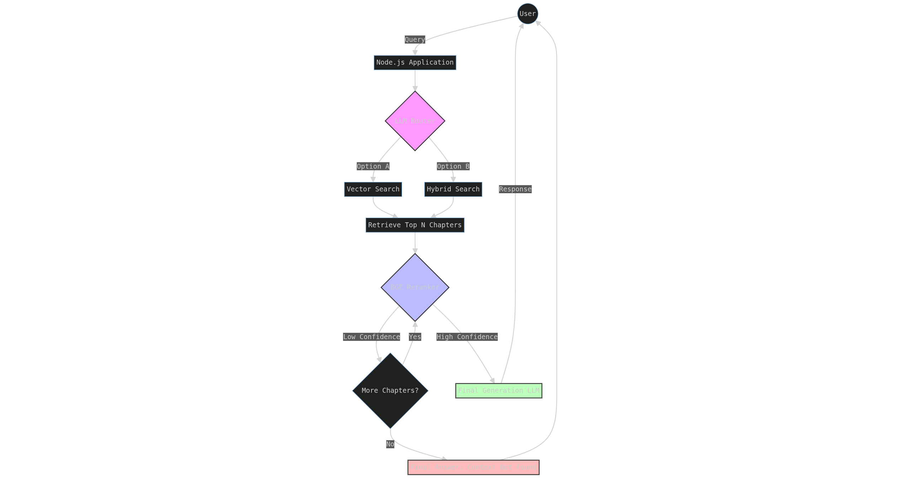

# RAG Local

A local Retrieval-Augmented Generation (RAG) system built with TypeScript, [LanceDB](https://lancedb.github.io/lancedb/) and [Ollama](https://ollama.com/).



## Overview

The system indexes a text document into a vector database and answers natural-language questions about it. It automatically routes each query to the best retrieval strategy:

- **Semantic search** — vector similarity via Ollama embeddings (best for conceptual questions)
- **Hybrid search** — full-text search (FTS) on the indexed chapters (best for proper nouns, names, places)

Results are optionally re-ranked using the [Cohere Rerank API](https://docs.cohere.com/reference/rerank) before being passed to the LLM.

## Architecture

```
User question
      │
      ▼
 selectRAGMode (LLM router)
      │
  ┌───┴────────────┐
  │ Semantic mode  │  Hybrid mode
  │ vector search  │  FTS search
  └───┬────────────┘
      │
 getContextFromNeighbors / getSingleChapterContent
      │
 Cohere Rerank (optional)
      │
 Ollama LLM → streamed answer
```

## Requirements

- [Node.js](https://nodejs.org/) 20+
- [Ollama](https://ollama.com/) running locally with:
  - `ollama pull nomic-embed-text`
  - `ollama pull mistral:7b-instruct`
- (Optional) A [Cohere API key](https://cohere.com/) for re-ranking

## Setup

```bash
npm install
```

Create a `.env` file (see [Environment variables](#environment-variables)):

```bash
cp .env.example .env   # then edit as needed
```

## Usage

### Start the interactive Q&A loop

```bash
npm run dev
```

On first run the document is indexed automatically. Subsequent runs skip re-indexing if the index already exists.

Type `exit` (or `quit` / `salir`) to quit.

### Re-index a different document at runtime

Set `DOCUMENT_PATH` in `.env` and delete the `data/` directory to force a fresh index.

## Environment variables

| Variable | Default | Description |
|---|---|---|
| `DOCUMENT_PATH` | `./texto.txt` | Path to the text document to index |
| `OLLAMA_URL` | `http://localhost:11434` | Ollama server URL |
| `LLM_MODEL` | `mistral:7b-instruct` | Ollama model for generation and routing |
| `EMBEDDING_MODEL` | `nomic-embed-text` | Ollama model for embeddings |
| `DB_PATH` | `./data` | Directory where LanceDB stores its files |
| `COHERE_API_KEY` | *(unset)* | Cohere API key — re-ranking is skipped if not set |
| `RERANK_THRESHOLD` | `0.8` | Minimum relevance score to keep a chunk after re-ranking |
| `QUERY_LIMIT` | `20` | Number of candidates retrieved from the vector DB |
| `TEXT_CHUNK_WIDE` | `2` | Neighbour chunks to include around each semantic hit |

## Project structure

```
├── config/       # Centralised env-var config
├── chunk/        # Text chunking strategies
├── db/           # LanceDB connection & document indexing
├── embedding/    # Ollama embedding generation
├── llm/          # Ollama generation + RAG mode router
├── rerank/       # Cohere rerank integration
└── index.ts      # CLI entry point
```

## Scripts

| Command | Description |
|---|---|
| `npm run dev` | Run in development mode (tsx + .env) |
| `npm run lint` | Run ESLint |
| `npm run format` | Format all TypeScript files with Prettier |
| `npm run format:check` | Check formatting without writing |
